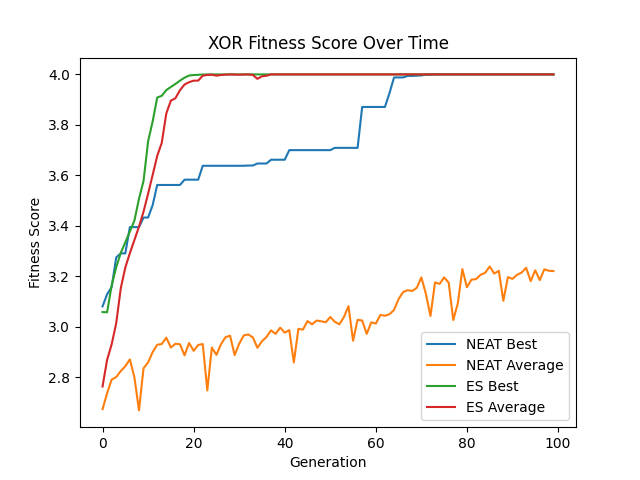

# Exploring Evolutionary Learning Techniques in Interactive Environments 

In this project, NeuroEvolution of Augmenting Topologies (NEAT) and Evolution Strategies (ES) are used in various OpenAI Gym environments: 

* CartPole-v1
* LunarLanderContinuous-v2 
* BipedalWalker-v3
* CarRacing-v0
* Pong-ram-v4

The project also includes custom code for distributed learning, which can be seen as options for training Pong. 

## Installation

This project uses Python 3 and has been tested on Ubuntu 18.04 and Windows 10 using `venv`. It should be fairly straightforward to install using Anaconda as well, but instructions for this are not listed. 

### Ubuntu 18.04 

**TODO**

### Windows 10 

It is more complicated to get the project to work on Windows. This is due to the build requirements of certain libraries used. There are two tools that must be downloaded: 

* [Microsoft Visual C++ Build Tools](https://visualstudio.microsoft.com/downloads/)
* [SWIG 3](https://sourceforge.net/projects/swig/files/swigwin/swigwin-3.0.12/)  
  Add the resulting folder to your system's path (only needs to be accessible during Python module installation)

Additionally, `ale_c.dll` is required to run any Atari environments. It has been included in the `res` folder. This file should be copied to `<python folder>/Lib/site-packages/atari_py/ale_interface/`. 

Now, you can install the project dependencies with `pip install -r requirements`. 

## Usage 

The following files can be run to train an environment with the specified technique. These files can be run with `python <filename>`. Note that it may be difficult to stop the applications due to Python's multiprocessing, the easiest way to quit would probably be to close the terminal running the file. When a generation is finished, a simulation will display showing that generation's best individual interacting in the environment (this window may hide behind others, make sure to clear your main display). 

| Algorithm | Environment | File | 
| --------- | ----------- | ---- |
| NEAT      | `XOR                      ` | `xor_neat.py         ` | 
| NEAT      | `CartPole-v1              ` | `cartpole_neat.py    ` | 
| NEAT      | `LunarLanderContinuous-v2 ` | `lunarlander_neat.py ` | 
| NEAT      | `BipedalWalker-v3         ` | `bipedal_neat.py     ` | 
| NEAT      | `CarRacing-v0             ` | `carracing_neat.py   ` | 
| NEAT      | `Pong-ram-v4              ` | `pong_neat.py        ` | 
| NEAT      | `Pong-ram-v4 (distributed)` | `pong_neat_distrib.py` | 
| ES        | `XOR                      ` | `xor_es.py           ` | 
| ES        | `CartPole-v1              ` | `cartpole_es.py      ` | 
| ES        | `LunarLanderContinuous-v2 ` | `lunarlander_es.py   ` | 
| ES        | `BipedalWalker-v3         ` | `bipedal_es.py       ` | 
| ES        | `CarRacing-v0             ` | `carracing_es.py     ` | 
| ES        | `Pong-ram-v4              ` | `pong_es.py          ` | 
| ES        | `Pong-ram-v4 (distributed)` | `pong_es_distrib.py  ` | 

### Distributed Training 

To train Pong with distributed computing, there are a few things you must do: 

1. Install this project on any machine that will be used. 
2. Setup port forwarding to workers can connect to the host machine. The default port is 4919. 
3. For each worker, run `python worker.py -t <num threads> -a <host address> -p <port>`. 
4. On the host system, run either distributed file (`pong_neat_distrib.py` or `pong_es_distrib.py`). 

The output of the host should look something like this: 
```
$ python pong_<alg>_distrib.py
Waiting for connections...
Starting server at :4919
Worker connected at 12.34.56.78:31415 with 12 thread(s) and 31.0GB of memory
Worker connected at 12.34.56.79:14142 with 16 thread(s) and 55.0GB of memory
Worker connected at 12.34.56.80:17320 with 16 thread(s) and 37.0GB of memory
Done!
.
.
.
```

The output of a worker should look something like this: 
```
$ python worker.py -t 12 -a 12.34.56.77 -p 4919
Starting worker process with 12 thread(s)
Connecting to 12.34.56.77:4919
Connected!
New shared data from server
Task from server: pong_es (id=1)
Task from server: pong_es (id=4)
Task from server: pong_es (id=7)
.
.
.
```

### Viewing Results 

The only environment that stores generational fitness history is `CarRacing-v0` (since there is too much debug text). For all others, terminal output must be manually copied and filtered into this format: 
```
<alg> Best, <alg> Average
<gen 1 best>, <gen 1 avg>
<gen 2 best>, <gen 2 avg>
.
.
.
```
For your convenience, there are pre-processed history files in the `models` folder. To view fitness graphs, use `python graph.py <env name> <neat hist file> <es hist file>`. 

As an example, `python graph.py XOR models/xor_neat_hist.txt models/xor_es_hist.txt` generates this graph: 

